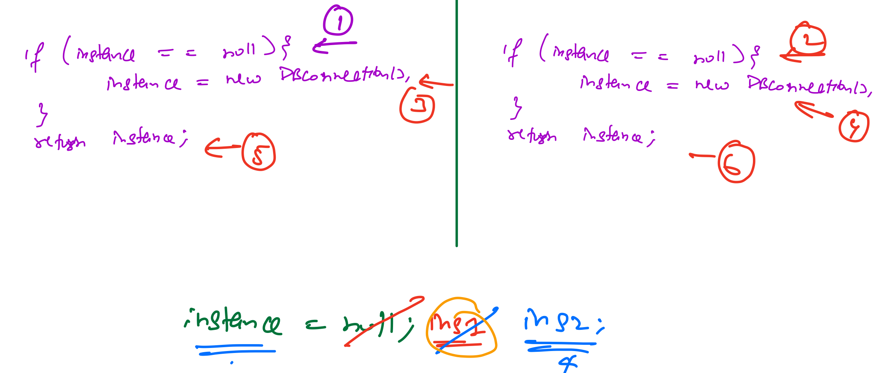

## Steps to make a class Singleton

    1. Make the constructor private
    2. Create a static method to return the DatabaseConnection instance
    3. Create a static variable of type DatabaseConnection & initialize with null
    4. Have checks in the getInstance() method,
        - If the object is created -> return
        - else -> create new object & return

## Concurrency Issues

1. Let's say the instance is initially null and 2 different threads enters the below if condition in the getInstance() 
method at the same time `if(instance == null) { instance = new DatabaseConnection(); }`
2. Since the instance is null, both the threads will get pass the if condition & both will 
create 2 different DatabaseConnection object, which violates the Singleton pattern
3. If thread 1 created the instance, it will assign the object to instance variable, then the thread 2 will
create another instance & overwrite the instance variable. One of the DatabaseConnection object will be garbage collected

## Singleton in Concurrent environment

### Eager Loading/Execution: (Version 2)

1. We can create the object of DatabaseConnection at the time of static variable initialization
2. So the actual object will be created during the class load or when the application starts

### Cons of Eager loading:

1. The issues with creating the object at the compile time slow down the application start time, 
if we follow this approach for all singleton objects present in the application
2. If any singleton object requires certain arguments to pass (any configuration details) to create the object, we can't pass
those parameters at the class load or application startup time (as the application is not completely started)
3. Due to lazy lading all the singleton objects are created & available even though it was not used by any code unit, which will
consume lots of unwanted memory unnecessarily.

